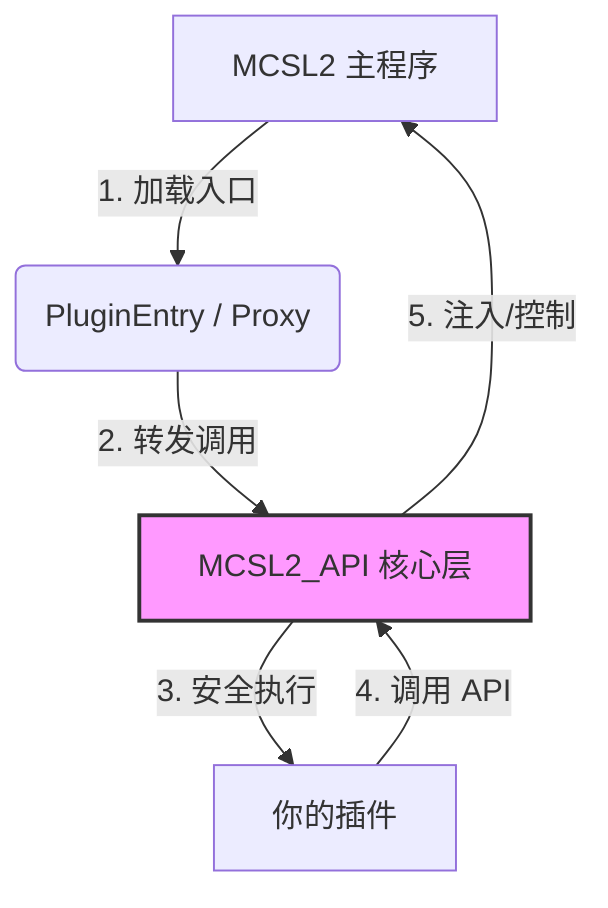

<div align="center">

# MCSL2 API


**为 MCSL2 打造的中间件与插件开发标准库**

<p>
    <a href="https://www.python.org/">
        
    </a>
    <a href="https://opensource.org/licenses/MIT">
        
    </a>
    <a href="https://docs.pydantic.dev/">
        
    </a>
</p>

<p>
    <a href="API_CALLING.md">📖 开发文档 (API_CALLING.md)</a> | 
    <a href="https://github.com/numakkiyu/MCSL2-API/issues">🐛 提交 Issue</a> | 
    <a href="https://github.com/MCSLTeam/MCSL2">MCSL2 主页</a>
</p>

</div>

---

## 📖 简介 (Introduction)

**MCSL2 API** 是一个独立于主程序的中间件库，旨在将 MCSL2 的插件开发从“脚本编写”升级为“工程化开发”。

它不仅仅是一个封装库，更是一套完整的 **Mod Loader 标准**。它通过**依赖注入**和**动态代理**技术，在不修改 MCSL2 主程序源码的前提下，为插件提供了：
* 🛡️ **线程安全护栏**：自动封送 UI 操作到主线程，防止闪退。
* 📡 **事件驱动架构**：基于发布/订阅模式的强类型事件总线。
* 📦 **标准化生命周期**：基于 `Manifest` 的依赖管理与版本控制。

---

## 🏗️ 架构原理 (Architecture)

MCSL2 API 充当了插件与宿主程序之间的安全层与翻译官。



------

## 🚀 核心特性 (Key Features)

| **特性**     | **传统模式 (Legacy)**       | **MCSL2 API 模式 (Modern)**          |
| ------------ | --------------------------- | ------------------------------------ |
| **线程模型** | ❌ 容易卡死/闪退             | ✅ **自动线程封送 (Auto-Marshaling)** |
| **交互方式** | ❌ 硬编码 GUI (无头模式崩溃) | ✅ **多模态抽象 (Notification/Log)**  |
| **事件系统** | ❌ 手动连接信号 (Fragile)    | ✅ **声明式订阅 (@Subscribe)**        |
| **元数据**   | ❌ 散乱的 config.json        | ✅ **Pydantic Manifest (依赖检查)**   |
| **兼容性**   | ❌ 强耦合主程序版本          | ✅ **Facade 适配器模式 (版本隔离)**   |

------

##  快速开始 (Quick Start)

### 1. 安装库

```bash
# 开发者推荐：安装为可编辑模式
pip install -e git+[https://github.com/numakkiyu/MCSL2-API.git#egg=MCSL2_API](https://github.com/numakkiyu/MCSL2-API.git#egg=MCSL2_API)
```

### 2. 编写第一个现代化插件

创建一个 `MyPlugin.py`，感受一下现代开发的优雅：

```python
from MCSL2_API import Plugin, PluginManifest, Context, Event
from MCSL2_API.models import ServerExitEvent

# 1. 定义身份与依赖
manifest = PluginManifest(
    id="my-awesome-plugin",
    version="1.0.0",
    dependencies=["mcsl-core>=2.0"],
    authors=["Developer"]
)

# 2. 编写逻辑类
class MyPlugin(Plugin):
    def on_enable(self, context: Context):
        # 线程安全的 UI 通知
        context.interaction.notify(f"插件 {self.manifest.id} 已启动！")

    # 3. 强类型事件订阅
    @Plugin.subscribe
    def on_crash(self, event: ServerExitEvent):
        if event.exit_code != 0:
            self.logger.error(f"服务器 {event.server_name} 崩溃了！")

# 4. 导出兼容层 (这是魔法发生的地方)
PluginEntry = MyPlugin.export(manifest)
```

------

## 📦 分发指南 (Vendor Mode)

由于最终用户可能没有安装 `pip` 环境，建议将本库打包在你的插件中。

**推荐目录结构：**

```Plaintext
Plugins/
└── MyPlugin/
    ├── MyPlugin.py
    └── _vendor/          <-- 将 MCSL2_API 文件夹复制到这里
        └── MCSL2_API/
```

**在插件头部加入路径注入代码：**

```python
import sys, os
sys.path.insert(0, os.path.join(os.path.dirname(__file__), "_vendor"))
# 现在可以正常导入了
from MCSL2_API import Plugin
```

------

## 贡献 (Contributing)

我们欢迎所有形式的贡献！请确保：

1. 新功能包含 Pydantic 模型定义。
2. 修改适配器时保持向后兼容。

------

本项目由 [北海的佰川](https://github.com/numakkiyu) 维护
License: [MIT](https://opensource.org/licenses/MIT)

<div align="center">
